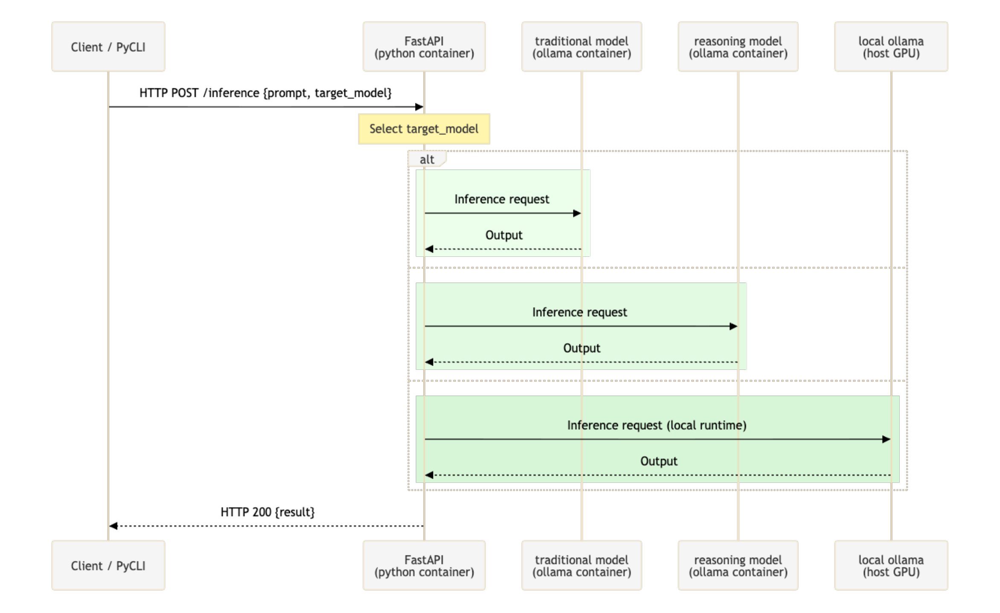
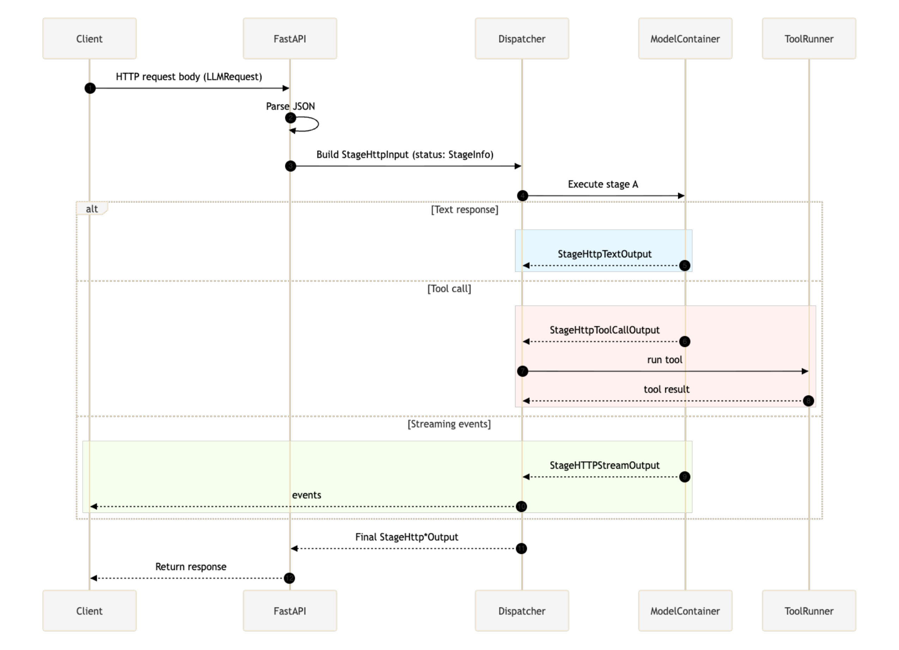

## Building Tool-Calling Patterns with OpenAI-Compatible LLMs and Ollama
- [Course Overview](#course-overview)
    - [Week 1: Starting from Zero](#week-1-starting-from-zero)
    - [Week 2: The Tool-Calling Journey](#week-2-the-tool-calling-journey)
    - [Week 3: Frontend Wire-up](#week-3-frontend-wire-up)
- [Workshop Architecture](#workshop-architecture)
    - [Stage Operation](#stage-operation)
    - [Orchestration Pattern](#orchestration-pattern)
- [Why Local First?](#why-local-first)
- [A Note on Terminology](#a-note-on-terminology)

## Course Overview

This 3-week, 9-chapter course builds a full-stack LLM tool-calling system from scratch.

By the end, you have a complete tool-calling application running on your machine with 5 local models. Every layer is yours to modify.

This course experiments with AI-assisted learning: each chapter starts with fully operational code and prompts provided in each chapter to learn about the content.

The latest chapter will always be merged into `main`.

`git pull origin main` and you'll be up to date with the latest code.

Each chapter is released as a separate branch (i.e., `02-chapter__fastapi-openai-chat-completions`) which you can reference at any point later.

### Week 1: Starting from Zero

Many tutorials assume you have a working development environment. Development setups are personal; if you have one that works, keep using it. I've included the setup I used to build this course.

By Friday, you'll watch different models return radically different responses to the same prompt. Some models use `<think>` tags, others don't. This variety made me ask "how could I use these differences?" rather than treating all models as interchangeable.

**Contents:** Python FastAPI backend with Pydantic validation, OpenAI-compatible tool calling, and SSE streaming. Everything runs locally via Docker and Ollama.

### Week 2: The Tool-Calling Journey

This course takes an opinionated approach combining tool definitions and tool validation logic into a centralized toolkit class, so all related components remain encapsulated together. This toolkit can then be registered in a central registry, providing a single source of truth for tool management across the system.

Week 2 concludes with a retrospective on how to handle streaming responses for better frontend integration.

**Contents:** Continue backend development, focusing on tool-calling patterns, error handling, validation, and architecture decisions to frontend integration.

### Week 3: Frontend Wire-up

Here's where we build something deployable—a TypeScript React UI that could actually ship to production.

But complexity comes back. Just because you can send SSE events doesn't mean your frontend knows what to do with them. How could you handle tool calls versus chat responses in your UI? We'll tackle these questions.

**Contents:** TypeScript React frontend with shadcn, TailwindCSS, and Zustand for state management.

## Workshop Architecture
This course begins with the foundational pieces for our workshop: Python ENV, Poetry for dependency management, Ollama for local models, FastAPI for our gateway, and Docker for containerization.

For ease of development, models are defined in a central `.env` file with variable names. Upon `docker-compose build`, these models are pulled.

**Traditional models** are optimized for fast pattern completion.

**Reasoning models** are optimized for step-by-step logical problem solving.

Models are then referenced by their optimization types within the framework. This enables a more natural, usage-based invocation from a front end perspective.

### Stage Operation

Each LLM request-response is organized into a stage where each stage supports 6 modes of operation.

| Mode                              | Description                                |
|------------------------------------|--------------------------------------------|
| Chat Completion                    | Standard chat response                     |
| Chat Streaming                     | Real-time chat response streaming          |
| Tool-call Completion               | Single tool-call response                  |
| Tool-call Streaming                | Streaming tool-call response               |
| Tool-call + Synthesis Completion   | Tool-call with synthesis, single response  |
| Tool-call + Synthesis Streaming    | Tool-call with synthesis, streaming response |

Each model type will be explored in detail throughout the course chapters.

### Orchestration Pattern

This course implements a developer-orchestration pattern using a Finite State Machine (FSM). Finite state machine architectures enable natural extension for error handling, retries, and chain creation for each stage.

(See [Course Motivation - When AI decides what's next](https://github.com/jrbrowning/ollama-tools-api/discussions/22) for more background on orchestration.)

### Why Local First?

This isn't about avoiding cloud services; cloud models are superior in many ways for tool calling. This course is about understanding the mechanics before you scale.

- **Privacy**: Your prompts, your tools, your data. All on your machine.
- **Cost**: Learn and experiment without burning through credits. Save them for production.
- **Speed**: No network latency during development. GPU-accelerated Ollama runs the best. CPU inference in Docker is slower, but works the same.
- **Control**: Debug, modify, break, fix. See exactly what's happening.

### A Note on Terminology

"Agent" means too many things to be useful here and is avoided intentionally.

To me, "agent" describes systems with different orchestration approaches:

- Computer use: Loop until task completion
- Assistant APIs: Manage conversation threads and state
- Framework agents: Route between chained LLM calls
- Autonomous systems: Recursively decompose and execute

Using precise terms clarifies what we're building: tool-calling with synthesis, not autonomous decision loops.

---
Disclaimer: This course is an independent project. I am not affiliated with, sponsored by, or endorsed by any of the companies or creators of the tools mentioned. All opinions and statements are my own and do not represent those of any company.
